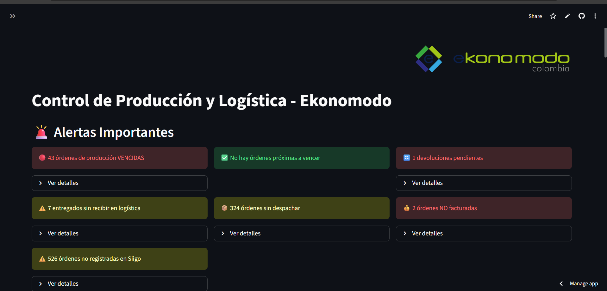
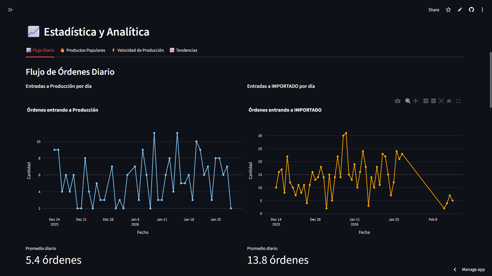
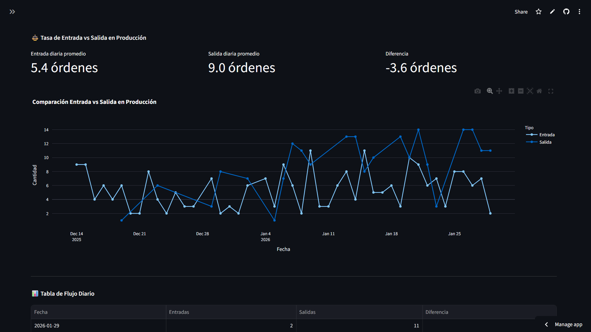

# Ekonomodo Business Dashboards

A suite of production-grade Streamlit dashboards built for **Ekonomodo**, a Colombian 
manufacturing and e-commerce company. The centerpiece is a real-time production and 
logistics control system connected live to Google Sheets.

Live data · Built for real operations · Python & Streamlit

---

## Featured Project: Production & Logistics Control Dashboard

### Screenshots

**Control Panel — Live Alerts**


**Analytics — Daily Order Flow**


**Analytics — Entry vs Exit Rate**


---

### Features

- **6 automatic alerts** updated in real time:
  - Overdue production orders
  - Orders due within 2 business days
  - Pending returns
  - Delivered but not received in logistics
  - Orders not dispatched
  - Orders not registered in Siigo ERP
  - Unbilled orders
- **Colombian business calendar** — lead times calculated excluding national holidays
- **Production speed ranking** by product
- **Daily order flow** — entries vs. dispatches with trend lines
- **Entry vs. exit rate analysis** with daily averages and gap detection
- **Tabs by status:** Production / Logistics / Received / Dispatched
- **Real-time search** across all active orders
- **Live connection** to Google Sheets — no manual data refresh needed

---

### Tech Stack

| Layer | Technology |
|---|---|
| Framework | Python · Streamlit |
| Data processing | Pandas |
| Charts | Plotly |
| Data source | Google Sheets API |
| Business logic | Colombian holiday calendar, ERP integration (Siigo) |
| Deployment | Streamlit Cloud |

---

### How It Works
```
Google Sheets (live data) → Sheets API → Pandas (processing) → Streamlit + Plotly (UI)
```

The operations team updates Google Sheets normally. The dashboard reads the data live 
and applies business logic — calculating business days, detecting overdue orders, 
flagging gaps between production and logistics — without any manual intervention.

---

## Other Dashboards in This Repo

| Project | Description |
|---|---|
| `Proyecto1_dashboard_ventas` | Sales analytics dashboard |
| `Proyecto2_dashboard_despachos` | Dispatch tracking dashboard |
| `Proyecto4_dashboard_pedidos` | Order management dashboard |
| `Proyecto6_dashboard_ventas_comparativo` | Comparative sales analysis |
| `Proyecto7_dashboard_Leidy` | Custom operations dashboard |
| `Proyecto8_dashboard_ventas_mensual` | Monthly sales dashboard |

All dashboards in this repo are built with Python + Streamlit + Google Sheets API 
and were delivered to the same real client (Ekonomodo, Colombia).

---

## Other Projects

| Project | Stack | Description |
|---|---|---|
| [MCI Consolidation Dashboard](https://github.com/juandacd/mci-dashboard) | JS · Google Sheets API | Multi-year membership analytics dashboard |
| Cell Group Management System | JS · Leaflet · Chart.js · Apps Script | Full system with map, auth, and public forms |

---

Built by [Juan David C.](https://www.fiverr.com/juandacd) · Available for freelance work on Fiverr
